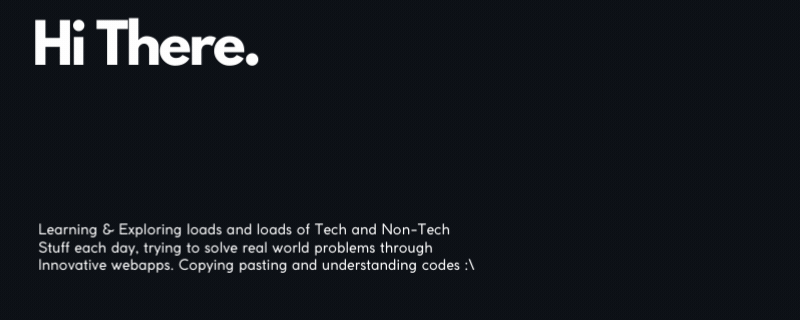

 

## About Me:
- 👨‍💻 MERN and Blockchain Developer from India, passionate about creating useful tools, websites, games, and web apps.
- 🌱 Currently diving deep into Web3 Development to craft robust and scalable solutions.
- 💡 Constantly seeking new challenges and learning opportunities to expand my skill set and make a positive impact.
- 😄 Enjoys infusing creativity into coding, whipping up coding memes, and experimenting with new recipes in the kitchen.
- 👉 Let's connect and collaborate on exciting projects!

 

## Tech Stack:

 

## Achievements:
- 🏆 Certificate in Beginners Track from SprintHacks 2.0 [KIET GDSC](https://drive.google.com/file/d/18c4AonD-EQuLAdVyrI__36DX8LgpS7B2/view?usp=drive_link)
  
 

## Socials:

